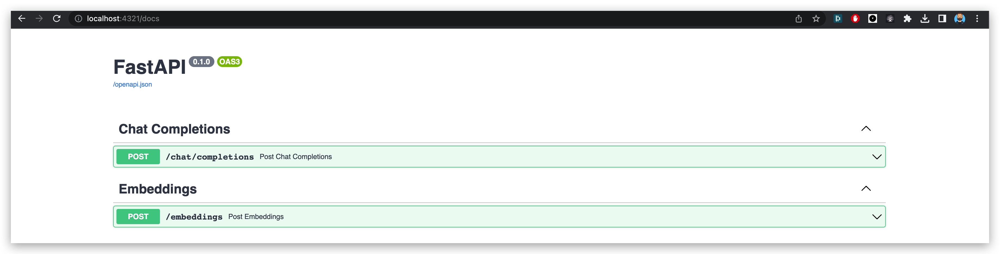

# Genoss GPT
## One line replacement for openAI ChatGPT & Embeddings powered by OSS models


<div align="center">
    
</div>

Genoss is a pioneering open-source initiative that aims to offer a seamless alternative to OpenAI models such as GPT 3.5 & 4, using open-source models like GPT4ALL.

## Features

- **Open-Source**: Genoss is built on top of open-source models like GPT4ALL.
- **One Line Replacement**: Genoss is a one-line replacement for OpenAI ChatGPT API.

## Demo

Chat Completion and Embedding with GPT4ALL


https://github.com/OpenGenenerativeAI/GenossGPT/assets/19614572/9cfd4f69-6396-4883-b94d-e94dd76663dc


## Supported Models

- GPT4ALL Model & Embeddings
- More models coming soon!


## Starting Up

Before you embark, ensure Python 3.11 or higher is installed on your machine.

## Models Installation

<details>
<summary>Install GPT4ALL Model</summary>
The first step is to install GPT4ALL, which is the only supported model at the moment. You can do this by following these steps:

1. Clone the repository:

```bash
git clone --recurse-submodules git@github.com:nomic-ai/gpt4all.git
```

2. Navigate to the backend directory:

```bash
cd gpt4all/gpt4all-backend/
```

3. Create a new build directory and navigate into it:

```bash
mkdir build && cd build
```

4. Configure and build the project using cmake:

```bash
cmake ..
cmake --build . --parallel
```

5. Verify that libllmodel.* exists in `gpt4all-backend/build`.

6. Navigate back to the root and install the Python package:

```bash
cd ../../gpt4all-bindings/python
pip3 install -e .
```

7. Download it to your local machine from [here](https://gpt4all.io/models/ggml-gpt4all-j-v1.3-groovy.bin) and put it in the `local_models` directory as `local_models/ggml-gpt4all-j-v1.3-groovy.bin`

</details>

## Running the Application
You need to install [poetry](https://python-poetry.org/docs/) and a valid python version (3.11*).
```bash
poetry install
```
For more, on a complete install for development purpose, you can check the [CONTRIBUTING.md](CONTRIBUTING.md).
If you simply want to start the server, you can install with the corresponding poetry groups :
```bash
poetry install --only main,llms
```

After the Python package has been installed, you can run the application. The Uvicorn ASGI server can be used to run your application:

```bash
uvicorn main:app --host 0.0.0.0 --port 4321
```

This command launches the Genoss application on port 4321 of your machine.

## Genoss API Usage

The Genoss API is a one-line replacement for the OpenAI ChatGPT API. It supports the same parameters and returns the same response format as the OpenAI API.

Simply replace the OpenAI API endpoint with the Genoss API endpoint and you're good to go!

Modify the models to the supported list of models and you're good to go!

You can find the API documentation at `/docs` or `/redoc`.




## Upcoming Developments

While GPT4ALL is the only model currently supported, we are planning to add more models in the future. So, stay tuned for more exciting updates.

The vision:

- Allow LLM models to be ran locally
- Allow LLM to be ran locally using HuggingFace
- ALlow LLM to be ran on HuggingFace and just be a wrapper around the inference API.
- Allow easy installation of LLM models locally
- Allow users to use cloud provider solutions such as GCP, AWS, Azure, etc ...
- Allow users management with API keys
- Have all kinds of models available for use (text to text, text to image, text to audio, audio to text, etc.)
- Be compatible with OpenAI API for models that are compatible with OpenAI API

 

## Contributions

Your contributions to Genoss are immensely appreciated! Feel free to submit any issues or pull requests.

## License

Genoss is licensed under the Apache2 License. For more details, refer to the [LICENSE](LICENSE) file.
